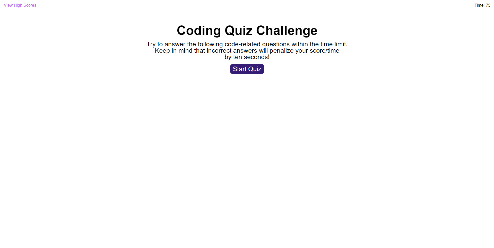
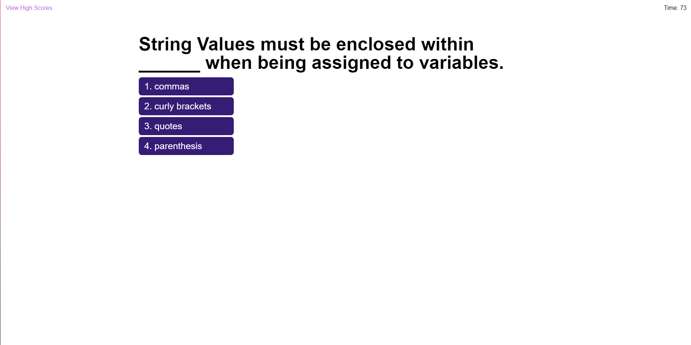
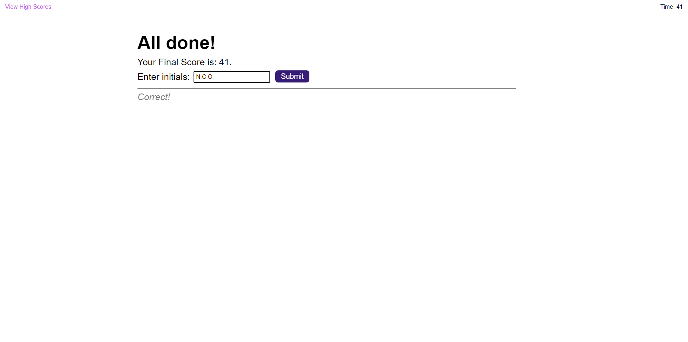
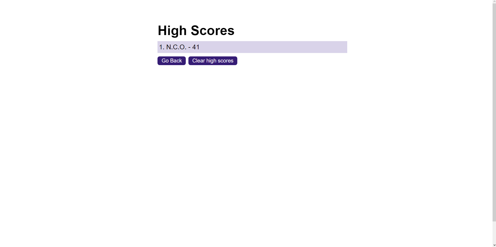

# Web-API-Coding-Quiz

## Description

This appliication is a coding quiz to test the user's knowledge of JavaScript. The project was created from scratch using my own knowledge of HTML, CSS, and JavaScript.

## Screenshot

## Usage

Press the "Start Quiz" button on the main page to begin. Answer all the questions before the timer runs out. Incorrect answers will take 10 seconds away from the timer. Once you are finished, enter your initials and click the "Submit" button or press enter to see the high scores. Press the "Clear High Scores" button to reset the list, and press the "Go Back" button to start over.

## Credits

N/A

## Link

https://nnamdionyeije.github.io/Web-API-Coding-Quiz/
